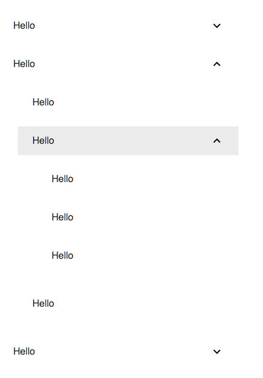

JavaScript React Material UI Override Component ClassName Demo
==============================================================

"material-ui"中关于style的使用比较奇怪，它并不是直接使用常见的css，而是使用了一个叫"jss"的库，
可以在js代码里写样式，再编译成相应的style。

在这里情况下，所有的classname都是不确定的，而是在编译时生成。
所以可以在development和production时生成两套不同的名字（想容易调试，还是想简短）。

有这样的好处的同时，也让我们在css常用的一些习惯无法使用。
比如我使用了两个组件，`<List>`和`<ListItem>`，在css的习惯中，如果把它们看作是普通的tag，那么我们可以这样定义：

```
List {
  color: red
}
ListItem {
  color: green
}
```

然而是不行的，因为编译完以后，HTML里是没有`List`和`ListItem`这样的tag的。
那么有没有一种方式，可以让我对所有的List或者ListItem一次性定义样式？
比如，假设`List`内部使用了一个`.List`的className，那我就可以：

```
.List {
  color: red
}
```

然而也没有。"material-ui"中不建议使用固定的css name，所以它也尽可能不提供。

但是它们自己内部总要使用一些class name吧。没错，以List为例，它在内部使用了以下class name:

- `root`
- `padding`
- `dense`
- `subheader`

（详情可见：https://material-ui.com/api/list/#css-api）

然后遗憾的是，这些名字只是一些JavaScript名字，当编译成css后，它们是会变的。
所以我们还是不能用`.root`这样的方式来自定义样式。

那怎么办呢？我们只能用它的方式来：

```
const style = (theme) => ({
  root: {
    color: 'red'
  }
})
```

然后在想改变的那个`List`那里也要做修改，比如：

```
<List classes={classes} />
```

或者

```
<List classes={{
  root: classes.root
}} />
```

这样就可以覆盖默认的`root`样式了（还需要一些其它代码配合）。

这种方式我觉得更多的是用于自定义theme，需要专门覆盖已有样式。我们在日常使用时，更多的还是通过：

```
<List className={classes.myName} />
```

不过需要把所有需要自定义样式的地方都加上类似这样的东西。

运行Demo
------

```
npm install
npm run dev
```

It will open the index page automatically.


